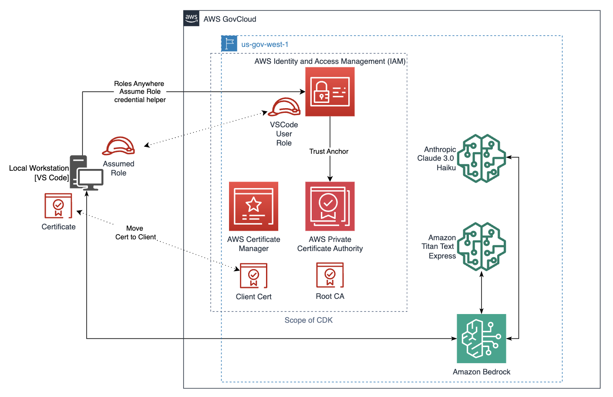

# VSCodeBedrock

## Description
This project is to build out a capability to utilize Amazon Bedrock directly in VS Code. The overall example utilizes the Continue plugin for VS Code, IAM Roles Anywhere, and Bedrock. 

As seen in the diagram below, this AWS Cloud Development Kit (CDK) code deploys a portion of the example and requires that the AWS Bedrock and local workstation configuration (including VSCode, Continue Plugin, and Certificate loading) be done outside of the code deployment. 

## Visuals

## Prerequisites

1. Credentials to the target AWS account to deploy and configure resources (Bedrock, IAM, Certificate Authority, Private Certificate Authority)
2. This deployment utilizes AWS CDK in Typescript. As a prerequisite to deployment, AWS CDK needs to be installed. https://docs.aws.amazon.com/cdk/v2/guide/getting_started.html
3. The account that you are deploying into should be bootstraped for CDK deployments. https://docs.aws.amazon.com/cdk/v2/guide/bootstrapping-env.html

## Installation

1. Clone or download the repo locally.
2. Navigate to the VSCodeBedrock folder.
3. Adjust any settings:
    a. Region:
     - Set to 'us-gov-west-1' as example but can be changed to the desired target region.
    b. Root Certificate:
     - templateARN: Change the partition if deploying outside of GovCloud
     - validity value: Adjust for certificate expiration requirements
    c. Client Certificate:
     - domainName: Replace 'your-domain.com' with your desired domain name
     - subjectAlternativeNames: add any alterntiave names as desired
     - keyAlgorithm: Optional setting, default is RSA_2048
    d. Trust Policy for IAM Roles Anywhere
     - String Condition: is set to string valule for the aws-us-gov partition, change if deploying in different partition
    e. Profile for IAM Roles Anywhere:
     - durationSeconds: how long before the authentication session should time out. Adjust as required.
4. Deploy CDK via 'cdk deploy'

## Cleanup

Created with AWS CDK so cleanup is done through rolling back the CDK deployment. 
1. From the folder that the VSCodeBedrock stack was deployed from issue 'cdk destroy' command. This will remove the deployed AWS CloudFormation stack in the AWS account. 
2. If following the blog post mentioned in the description section, you should also remove the client certificate from the local workstation and remove access to Amazon Bedrock Foundation Model being used. https://docs.aws.amazon.com/bedrock/latest/userguide/model-access-modify.html 

## Authors and acknowledgment
Keith Boaman - AWS Sr Solutions Architect

Andrew Istfan - AWS Solutions Architect 

## License
This library is licensed under the MIT-0 License. See the LICENSE file.

Although this repository is released under the MIT-0 license, the overall example (outside this code) will utilize the Continue.dev Plugin which is licensed and provided seperately, through Apache 2.0.
https://github.com/continuedev/continue/blob/main/LICENSE

## Legal Disclaimer
You should consider doing your own independent assessment before using the content in this sample for production purposes. This may include (amongst other things) testing, securing, and optimizing the content provided in this sample, based on your specific quality control practices and standards.
